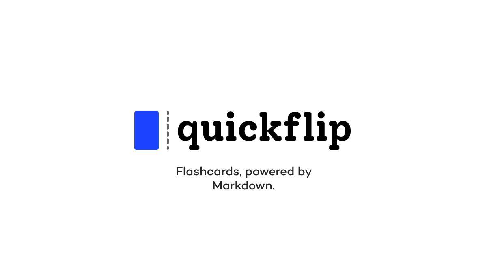

<p align="center"><a href="https://quickflip.app" target="_blank"></a></p>

</br>

[QuickFlip](https://quickflip.app) is a simple React app with flashcards powered by Markdown for studying.

### Usage

Import flashcard set from any Github repo, must contain a `quickflip.json` file with the following JSON, markdown supported.

```json
[{
      {
    "id": "1",
    "question": "### Name a famous city",
    "answer": "`Kingston, Jamaica`",
    "category": "General"
  }
}]
```

### Develop
Run the following to install dependencies and start dev server (Vite).
```bash
λ npm i
λ npm run dev
```
### Flash Card Sets

Please see some sample flashcard sets 

- [quickflip-sample](https://github.com/heyjordn/quickflip-sample)
- [quickflip-ckad](https://github.com/heyjordn/quickflip-ckad) 